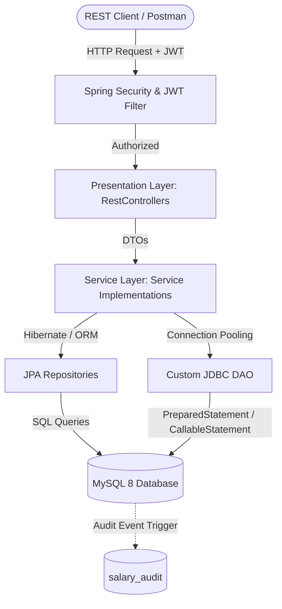
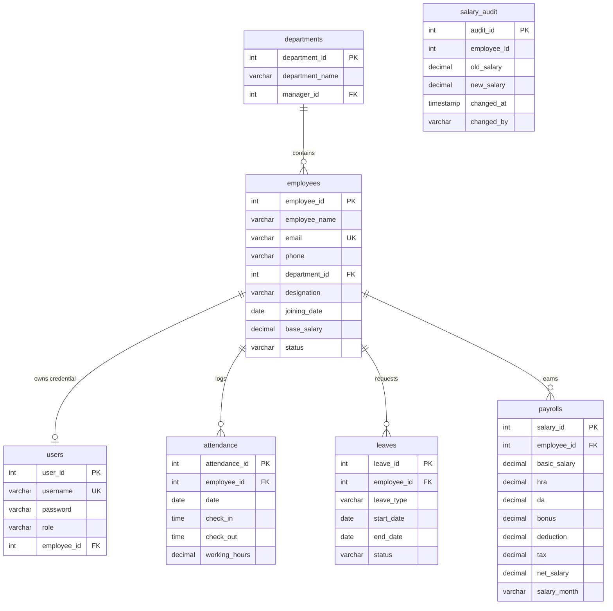

# Employee Payroll Management System

An enterprise-grade Employee Payroll Management System built with **Java 21, Spring Boot, JDBC, JPA/Hibernate, MySQL 8, and Maven**. 

This system features a hybrid data-access architecture: using **Spring Data JPA** for standard ORM/CRUD, pagination, and sorting; and raw **JDBC (utilizing HikariCP)** for transactional batch salary generation, stored procedure execution, and advanced analytics reports.

---

## Folder Structure

```
Employee_Payroll/
│
├── pom.xml                                 # Maven dependencies and configuration
├── README.md                               # Project documentation, architectures, and diagrams
├── postman_collection.json                 # Complete API Postman testing suite
│
└── src/
    ├── main/
    │   ├── java/
    │   │   └── com/
    │   │       └── payroll/
    │   │           ├── EmployeePayrollApplication.java      # Spring Boot application entrypoint
    │   │           │
    │   │           ├── config/
    │   │           │   ├── DatabaseConfig.java              # HikariCP Connection Pool setup
    │   │           │   ├── SecurityConfig.java              # Spring Security configuration (RBAC)
    │   │           │   └── JwtAuthenticationFilter.java     # JWT verification filter
    │   │           │
    │   │           ├── controller/
    │   │           │   ├── AuthController.java              # JWT authentication endpoints
    │   │           │   ├── EmployeeController.java          # Employee CRUD & SP salary updates
    │   │           │   ├── DepartmentController.java        # Department CRUD
    │   │           │   ├── AttendanceController.java        # Attendance logging & history
    │   │           │   ├── LeaveController.java             # Leave request & SP approvals
    │   │           │   └── PayrollController.java           # Payroll generation, PDF slip exports, & SQL Analytics
    │   │           │
    │   │           ├── service/
    │   │           │   ├── EmployeeService.java
    │   │           │   ├── EmployeeServiceImpl.java         # Employee services, auto-user generation
    │   │           │   ├── DepartmentService.java
    │   │           │   ├── DepartmentServiceImpl.java
    │   │           │   ├── AttendanceService.java
    │   │           │   ├── AttendanceServiceImpl.java
    │   │           │   ├── LeaveService.java
    │   │           │   ├── LeaveServiceImpl.java            # Leave request approval triggers
    │   │           │   ├── PayrollService.java
    │   │           │   ├── PayrollServiceImpl.java          # Batch generation & reporting services
    │   │           │   └── UserDetailsServiceImpl.java      # UserDetailsService implementation for RBAC
    │   │           │
    │   │           ├── repository/
    │   │           │   ├── EmployeeRepository.java          # JpaRepositories
    │   │           │   ├── DepartmentRepository.java
    │   │           │   ├── AttendanceRepository.java
    │   │           │   ├── LeaveRepository.java
    │   │           │   ├── UserRepository.java
    │   │           │   └── PayrollRepository.java
    │   │           │
    │   │           ├── dao/
    │   │           │   ├── ConnectionFactory.java           # Connection getter wrapping HikariCP
    │   │           │   ├── PayrollJdbcDao.java
    │   │           │   └── PayrollJdbcDaoImpl.java          # Raw JDBC transactions, batches, & SP calls
    │   │           │
    │   │           ├── entity/
    │   │           │   ├── Employee.java                    # JPA Entities
    │   │           │   ├── Department.java
    │   │           │   ├── User.java
    │   │           │   ├── Attendance.java
    │   │           │   ├── Leave.java
    │   │           │   └── Payroll.java
    │   │           │
    │   │           ├── dto/
    │   │           │   ├── AuthRequest.java                 # Data Transfer Objects
    │   │           │   ├── AuthResponse.java
    │   │           │   ├── EmployeeDto.java
    │   │           │   ├── DepartmentDto.java
    │   │           │   ├── LeaveDto.java
    │   │           │   ├── AttendanceDto.java
    │   │           │   ├── PayrollDto.java
    │   │           │   └── SalarySlipDto.java
    │   │           │
    │   │           ├── exception/
    │   │           │   ├── GlobalExceptionHandler.java      # REST Exception boundary handling
    │   │           │   ├── ResourceNotFoundException.java
    │   │           │   └── CustomDatabaseException.java
    │   │           │
    │   │           └── util/
    │   │               ├── JwtUtil.java                     # JWT signing and parsing utility
    │   │               └── PdfGeneratorUtil.java            # PDF Export generator (OpenPDF)
    │   │
    │   └── resources/
    │       ├── application.properties                       # Spring configuration & profiles
    │       ├── schema.sql                                   # Normalized database schemas
    │       ├── sample_data.sql                              # Seed data and mock users
    │       ├── stored_procedures.sql                        # Database stored procedures
    │       └── triggers.sql                                 # Audit logging triggers
    │
    └── test/
        └── java/
            └── com/
                └── payroll/
                    ├── EmployeePayrollApplicationTests.java # Context loading test
                    └── controller/
                        └── EmployeeControllerTest.java      # MockMvc unit testing
```

---

## System Architecture



---

## Entity-Relationship (ER) Diagram



---

## Database Design Rules (BCNF Compliance)

To qualify for BCNF, the following rules are enforced on all relations:
1. No functional dependencies exist where the left-hand side is not a candidate key.
2. Circular relationship issues (such as `employees.department_id` and `departments.manager_id`) are resolved by allowing the department manager field to be nullable, and updating manager references post-insert.
3. Check constraints validate employee status values (`ACTIVE`, `INACTIVE`, `SUSPENDED`), leave classifications (`SICK`, `CASUAL`, `ANNUAL`), and ensure numeric calculations (such as salaries and taxes) remain non-negative.
4. Custom performance indexes are created on `employee_id`, `department_id`, `salary_month`, and `email` columns to optimize complex search queries.

---

## Stored Procedures & Triggers

### 1. Procedures
* **`GenerateMonthlySalary(in_employee_id, in_month)`**: Evaluates employee base salary, counts approved monthly leaves, calculates HRA (20%), DA (10%), subtracts leave-based deductions (Base / 30 for days > 2), calculates 12% tax, and inserts the result.
* **`ApproveLeave(in_leave_id, in_status)`**: Updates the status of a leave request using atomic validations.
* **`UpdateEmployeeSalary(in_employee_id, in_new_salary)`**: Directly updates the employee base salary.

### 2. Triggers
* **`after_employee_salary_update`**: Activated after an employee's `base_salary` is updated. It logs changes into `salary_audit` containing old salary, new salary, change timestamp, and the executing database user (`USER()`).

---

## Advanced SQL Integrations

* **Window Functions (`RANK()`, `DENSE_RANK()`, `ROW_NUMBER()`)**: Analyzes salary ranks across the entire system.
* **LAG() / LEAD()**: Inspects historical growth trends by contrasting consecutive month-over-month payouts.
* **Recursive CTE**: Dynamically constructs organizational tree hierarchies, tracing direct and indirect reporting channels back to the CEO.
* **Complex Joins**: Correlates employee registries, departments, attendance tallies, and monthly payrolls.

---

## Quick Start & Verification Steps

### 1. Database Setup
1. Launch MySQL and create the target database:
   ```sql
   CREATE DATABASE employee_payroll_db;
   ```
2. Set your MySQL username and password inside the `src/main/resources/application.properties` file:
   ```properties
   spring.datasource.username=root
   spring.datasource.password=yourpassword
   ```
3. When the application starts, it will automatically populate the schemas using `schema.sql` and insert sample data using `sample_data.sql`.
4. Run `stored_procedures.sql` and `triggers.sql` inside your MySQL workbench to initialize procedures and triggers.

### 2. Launching the App
Run the application using Maven:
```bash
mvn clean install
mvn spring-boot:run
```

### 3. Testing Credentials (JWT Login)
All default test passwords are: **`password`**

* **Admin Username**: `admin`
* **HR Username**: `eddard_hr`
* **Employee Username**: `jon_emp` or `tyrion_emp`

### 4. Running Postman Collections
Import the [postman_collection.json](file:///C:/Users/Asmita/OneDrive/Desktop/Employee_Payroll/postman_collection.json) into Postman to invoke authentication, employee management, and analytics queries directly.
